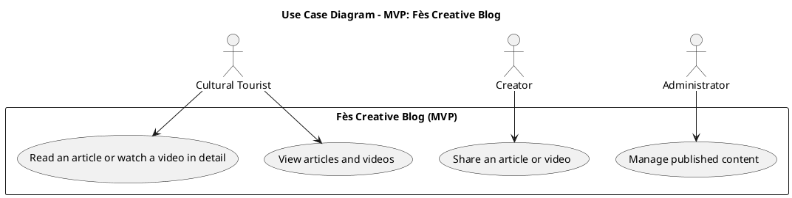

تمام 🔥، هادي هي النسخة الجاهزة ديال **prompt** مكتوبة بنفس الشكل اللي ورّيتي، ولكن هاد المرة خاصة بمشروعك:
**“Fès Creative Blog – Ancestral & Modern Fès”**
قادرة تعطي لـ **Claude AI** أو **أي AI generator** كل التفاصيل باش يبني ماكيت احترافية وواقعية 💪

---

## 🕌 Context

🎯 **1. Project Context**
Collaborative blog dedicated to connecting **traditional craftsmanship** and **modern innovations** in **Fès**.
Objective: showcase the city’s artisanal heritage, highlight creative modern projects, and connect **tourists, artisans, and young creators** through cultural and digital storytelling.

---

🎨 **2. Style & Design**
Style: elegant, cultural, and modern — a bridge between **heritage and innovation** 🧵💡
Colors: **gold (#d4af37)**, **dark blue (#0b132b)**, **beige**, and **white**
Layout: clean grid, full-width hero section, cultural visual identity (patterns, calligraphy accents)
Look & Feel: magazine / creative blog / cultural hub
Framework: **Tailwind CSS (via CDN)** + soft animations

---

🧱 **3. Pages to Include**

**Public Area:**

* Home
* Articles / Videos
* Article Detail

**Admin Area:**

* Manage Content (CRUD simulation)

---

📌 **4. Main Sections**

| Section             | Description                                                                   |
| ------------------- | ----------------------------------------------------------------------------- |
| Header + Navigation | Logo “Fès Creative Blog” + menu (Home, Explore, About, Admin)                 |
| Hero Section        | Background photo of Fès Medina with slogan “Where Tradition Meets Innovation” |
| Article Grid        | Display latest posts (title, image, short text)                               |
| Featured Creators   | Highlight young artisans or creators with photo + tagline                     |
| Footer              | Contact, social media links, short description                                |

---

🧑‍🤝‍🧑 **5. User Experience**

* Full responsive (mobile / tablet / desktop)
* Simple navigation between pages
* Smooth transitions and hover effects
* Each article has “Read More” → leads to detail page
* Article page includes: title, media (image/video), description, and share buttons
* Admin page: simple mockup (add/edit/delete buttons — simulation only)

---

⚙️ **6. Technologies**

* **HTML + Tailwind CSS (CDN only)**
* **Vanilla JavaScript** (for reading query params, simulating CRUD, etc.)
* No frameworks or build tools
* **FontAwesome icons** for share, edit, delete, etc.

---

✍️ **7. Expected Format**

* Clean and commented HTML + CSS
* Fully responsive
* Structure:

  * `index.html` → Home
  * `article.html` → Article Detail
  * `admin.html` → Manage Content
* Optional: `style.css` for minor custom styles

---

📊 **8. Use Case Diagram — MVP: Fès Creative Blog**

---

🗂️ **9. Site Map — Blog “Fès Creative Blog”**

### 🌍 Public Space

| Page                 | Description                                                          |
| -------------------- | -------------------------------------------------------------------- |
| Home                 | Landing page featuring the latest articles and videos + hero section |
| Articles / Videos    | Grid view with filters (heritage, design, innovation)                |
| Article Detail       | Full article with title, image, description, and share button        |
| Favorites (optional) | Saved articles by the user (localStorage)                            |
| About (optional)     | Vision, mission, and story of the blog                               |

### 🔐 Admin Space

| Page            | Description                                     |
| --------------- | ----------------------------------------------- |
| Admin Dashboard | Summary of published content                    |
| Manage Content  | CRUD simulation: add/edit/delete dummy articles |

---

🛠️ **10. Key Features**

✅ View and read articles
✅ Share article link
✅ Manage content (Admin only)
✅ Responsive Tailwind design
✅ Elegant cultural theme blending tradition and innovation

---

Would you like me to **add an example of color palette + typography suggestion** (for Claude to make the design visually richer and more “Fès-inspired”)?
It can help it generate more realistic UI.
